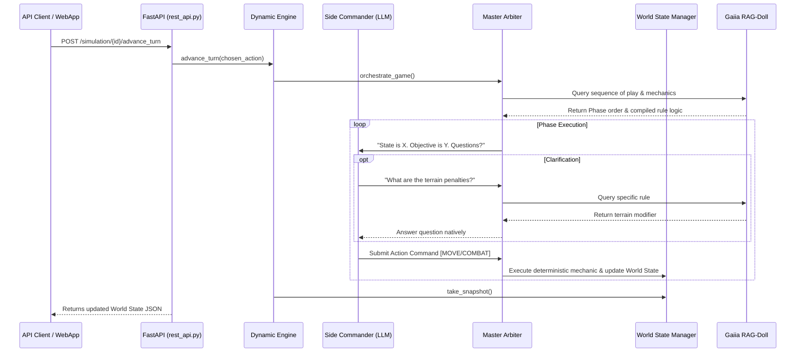

# Gaiia Prime Radiant — Scale-Spanning Simulation Engine

**Gaiia Prime Radiant** is a scale-spanning, rule-governed simulation arbiter and game master engine. It accepts an authoritative world-state context and mission objective, queries an external rule corpus via [Gaiia RAG-Doll](file:///c:/programming/aiia/gaiia-rag-doll), and produces optimal-action recommendations, probabilistic outcome distributions, and causal reasoning chains — complete with citations traceable to governing rulebooks.

---

## 🏛️ System Design Architecture

Gaiia Prime Radiant operates as an autonomous Master Arbiter (Game Master) integrated with a dynamic language model and RAG-Doll. Rather than hardcoding mechanical turn sequences, the engine dynamically discovers the Sequence of Play and compiles deterministic Python physics mechanics on the fly.



---

## 📐 Multi-Scale Hierarchy (`engine/scales/`)

The simulation engine supports 6 operational scales, each with distinct physics and combat models:

1. **Centurion Scale** (`centurion_scale.py`): Tactical ground armor, vector movement, facing angles, and armor damage grids.
2. **Interceptor Scale** (`interceptor_scale.py`): High-speed aero-space fighters, thrust vectors, atmospheric drag, and weapon heat.
3. **Legionnaire Scale** (`legionnaire_scale.py`): Infantry squads, command cohesion, suppression, and tactical cover.
4. **Leviathan Scale** (`leviathan_scale.py`): Massive capital warships, multi-compartment internal damage grids, and turret batteries.
5. **Prefect Scale** (`prefect_scale.py`): Operational campaign level, theater logistics, supply lines, and sector control.
6. **Base Scale** (`base_scale.py`): Abstract base class defining universal tick, resolve, and serialize interfaces.

---

## 📦 Core Subsystems (`engine/`)

- **Dynamic Engine & Master Arbiter** (`engine/simulation/`): Core turn loop, phase transitions, and damage resolution.
- **World State Manager (WSM)** (`engine/models/world_state.py`): Authoritative hierarchical state graph backed by NetworkX (`wsm_networkx.py`).
- **Soft State Layer** (`engine/models/`): Tracks continuous psychological and logistical variables (morale, cohesion, suppression).
- **Rule Compiler & Cache** (`engine/rules/`): Compiles natural language rules into executable Python scripts cached in `state/cache/rule_cache.db`.
- **Rule Feedback Interface (RFI)** (`engine/rules/`): Captures rule ambiguities in `state/event_log/rfi_feedback.db` for human adjudication.
- **Adversarial Planner & Side Commanders** (`engine/planner/`): LLM-driven faction commanders executing doctrine profiles (Aggressive, Defensive, Neutral).

---

## ⚙️ Installation & Setup

### Prerequisites
- **Python**: 3.11+ (Python 3.13 recommended)
- **Gaiia RAG-Doll**: Installed and running for rule retrieval

### Setup Virtual Environment
```bash
# 1. Navigate to directory
cd gaiia-prime-radiant

# 2. Create virtual environment
python -m venv venv

# 3. Activate virtual environment
# Windows:
.\venv\Scripts\activate
# Linux/macOS:
source venv/bin/activate

# 4. Install package in editable mode
pip install -e .
```

---

## 🚀 Running the API Server

Prime Radiant exposes a REST API via **FastAPI** (`engine/api/rest_api.py`):

```bash
# Start FastAPI server on port 8000
uvicorn engine.api.rest_api:app --reload --port 8000
```

### Core Endpoints:
- `POST /simulation/new`: Instantiate a new simulation scenario.
- `GET /simulation/{sim_id}/state`: Retrieve current World State JSON.
- `POST /simulation/{sim_id}/recommend_actions`: Request optimal action distributions for a unit.
- `POST /simulation/{sim_id}/advance_turn`: Apply an action and advance the simulation tick.

---

## 🧪 Testing

Run the pytest test suite:

```bash
pytest tests/
```

### Test Coverage:
- `test_centurion_movement.py` / `test_centurion_combat.py`: Ground armor tactical mechanics.
- `test_cross_scale_bus.py`: Inter-scale communication (e.g. ground units calling aero-space strikes).
- `test_rule_compiler.py` & `test_rule_cache.py`: Dynamic rule compilation and SQLite caching.
- `test_soft_state_layer.py`: Morale and suppression tracking.
- `test_rest_api.py`: FastAPI endpoint integration.
