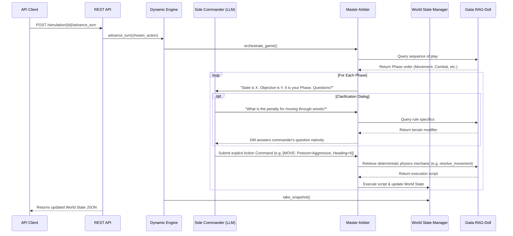

# Gaiia Prime Radiant — Simulation Engine Foundation

*The Prime Radiant is a scale-spanning, rule-governed simulation engine that accepts a world-state context and an objective, queries a rules corpus via Gaiia RAG-Doll, and produces optimal-action recommendations, probabilistic outcome distributions, and causal reasoning chains — all presented with citations traceable back to the governing rule set.*

## System Design Architecture

Gaiia Prime Radiant operates as a Master Arbiter (Game Master) that relies entirely on a language model integrated with an external RAG-Doll rule corpus. Rather than hardcoding turn sequences and mechanics, the Engine reads the rules natively to orchestrate the simulation.

### Core Components

- **Dynamic Engine / Master Arbiter**: The central orchestrator loop. It queries RAG-Doll to discover the game's sequence of play (e.g. Initiative, Movement, Combat phases) and hosts the conversational dialogue with faction commanders. It resolves physics via compiled deterministic Python functions cached during runtime.
- **Action Planner (Side Commanders)**: The entity responsible for a specific faction (e.g., Commonwealth or TOG). The Commander is provided with a World State, an objective, and the ability to ask the Master Arbiter questions before deciding on a structured action (e.g. `[MOVE: Posture=Aggressive, Heading=4, EndVelocity=3]`).
- **World State Manager (WSM)**: Manages authoritative in-memory hierarchical state models. It tracks the physical grid, unit positioning (using string identifiers like `"1001"`), and handles serialization of the board state for the API.
- **Soft State Layer**: Tracks continuous variables (e.g., morale, suppression, command cohesion) that modulate probabilistic outcomes and decision compliance.
- **Rules Interface**: Translates simulation queries to RAG-Doll queries using a three-path routing mechanism (exact reference match, semantic caching, full LLM pipeline).
- **Rule Feedback Interface**: Logs and tracks uncertain rule determinations for human refinement.

## What is a World State?

The **World State** is the authoritative, layered object graph representing the simulation universe at a specific moment. It is strictly separated from the engine logic and the REST API.

A World State natively contains:
- **Map Hexes**: The Cartesian grid converted into standard 4-digit string coordinate IDs (e.g., `"1001"` up to `"1020"`). It maps hexes to terrain types and elevations.
- **Units**: Faction-aligned entities (e.g., `CenturionUnit`) holding spatial data (position, heading, velocity), integrity (damage grids), and metadata.
- **Soft State**: A subunit attached to every entity tracking psychological or logistical modifiers like `morale` (0.0 - 1.0) and `suppression`.

The World State is immutable between ticks. The `WorldStateManager` checkpoints states via snapshotting, allowing for branches and scenario rollbacks.

## What is a Scenario?

A **Scenario** is the initial contextual configuration that drives the `DynamicEngine` orchestration. 

A fully defined scenario consists of:
1. **The Objective**: A natural language goal defining the purpose of the simulation (e.g., *"get as close to the enemy tank as you can"* or *"destroy the enemy command post"*). The Arbiter explicitly passes this objective to the Side Commanders to inform their LLM-driven decision-making.
2. **Initial World State**: The layout of the map hexes, the terrain features, and the starting coordinate spawn locations for all participating units.
3. **Faction Profiles / Doctrine**: The alignment of Side Commanders and their intended doctrine (Aggressive, Defensive, Neutral), which the LLM uses to evaluate the rules.
4. **Target Phase (Optional)**: For testing or isolated scenario simulations, a scenario can be bound to execute only a specific sub-phase (like the *Movement Phase*).

## API & Interface

Gaiia Prime Radiant utilizes a thin Transport Layer via **FastAPI** (`rest_api.py`). The API does not instantiate maps or spawn units natively; it spins up a decoupled `DynamicEngine` instance which handles the internal initialization (`initialize_default_scenario`).

The Engine exposes high-level endpoints to:
- Instantiate a new scenario branch (`/simulation/new`)
- Retrieve current world state (`/simulation/{sim_id}/state`)
- Request optimal actions for a unit (`/simulation/{sim_id}/recommend_actions`)
- Apply a resolved action and advance the sequence (`/simulation/{sim_id}/advance_turn`)

## System Interaction Flow

The following sequence diagram illustrates the core execution loop when the engine receives an API request to advance the turn. It highlights the conversational "DM-to-Player" orchestration between the Master Arbiter, the Side Commanders, and the external RAG-Doll rulebook.

## Bring Your Own Rules (BYOR)

Because Gaiia Prime Radiant does not hardcode specific mechanics or turn sequences, you can completely swap out the default *Renegade Legion* rulebook for your own tabletop wargame, business simulation, or compliance framework.

To apply your own rules to the engine:

1. **Ingest Your Corpus**: Feed your rulebook PDFs, markdown documents, or policy files into the **Gaiia RAG-Doll** indexing pipeline. RAG-Doll will vectorize and semantically chunk the rules.
2. **Define Entity Profiles**: Create standard JSON profiles for your units (e.g., mechs, squads, or business departments). These profiles should define attributes (like `thrust` or `budget`) and structural integrity (like `armor_grids` or `headcount`). 
3. **Point the API to Your Corpus**: When creating a new simulation via `/simulation/new`, provide your custom `corpus_profile` string. 
4. **Initialize the State**: Provide a custom `initialize_default_scenario()` or inject your own World State snapshot that uses your specific terrain/map definitions.

Once configured, the `MasterArbiter` will dynamically read *your* sequence of play, query *your* mechanics, and automatically generate and cache the deterministic Python scripts needed to run them!
